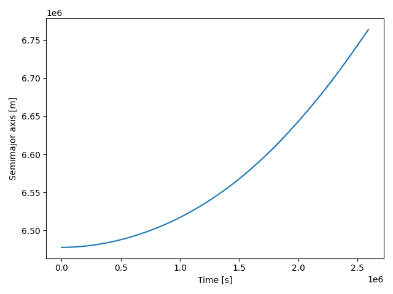

# tidal-station-keeping-barbell

Prototype simulator for tidal station-keeping.  It now supports both a
single point-mass orbiter and a counter-rotating double barbell
spacecraft. The barbell model propagates orientation and angular
momentum explicitly while controllers command tether-length accelerations
rather than idealized quadrupole magnitudes.

Craft geometry is specified under a `craft` section in the configuration,
while controllers own all initial conditions via `controller.initial`.

See the [physics model](docs/physics_model.md) for the simplified Earth–Moon tidal forces, the
[bang‑bang control law](docs/control_law.md) that schedules tether extensions, and
[numerical integration details](docs/numerics.md).

## Example orbit evolution



The plot above shows how the simulated barbell slowly raises its orbit.  The
semimajor axis—the average size of the orbit—grows as the counter-rotating
booms exchange angular momentum with the surrounding gravitational field.

This capability hints at practical value for a future space economy.  If a
spacecraft can adjust its orbit using tidal effects instead of propellant, it
reduces resupply needs and extends operational lifetimes.  Long-lived platforms
that can maneuver economically are better suited for activities such as
resource transport, on-orbit servicing, and manufacturing, all of which are
expected to be cornerstones of sustained economic activity beyond Earth.

## Running simulations

1. Install dependencies:
   ```bash
   python -m venv .venv
   . .venv/bin/activate
   pip install -r requirements.txt
   ```
   or `make setup`.
2. Run a single point-mass case:
   ```bash
   python sims/run_point_mass.py --config configs/leo_100km.yaml
   ```
3. Run the baseline barbell case:
   ```bash
   python sims/run_leo_100km.py --config configs/leo_100km.yaml
   ```
   The script writes `outputs/leo_100km.csv` and quicklook plots for the
   semimajor axis, tether length, angular velocity, and eccentricity (e.g.,
   `outputs/semi_major_axis.png`). An HTML report is saved to
   `outputs/html/run_summary.html` summarizing the run and embedding all images.
4. Additional simulations:
   ```bash
   python sims/run_sweep_extent.py
   ```
   produces a sweep over boom length. Use `plotting.quicklook` or custom analysis on the CSV logs for other plots.

Training and usage of a neural-network controller are covered in the
[neural controller guide](docs/neural_controller.md).

Initial barbell angle is configured via `controller.initial.theta0` (radians).
Adjust this value—or supply a list when using `sims/run_fom_scenarios.py`—to explore different
orientations.

Passive-drift behavior after one month is summarized in
[passive simulation findings](docs/passive_simulation_findings.md); the
reproduction script [docs/passive_drift_repro.py](docs/passive_drift_repro.py) recreates
those results.

For a detailed project overview and development roadmap see the [project overview](docs/overview.md)
and the [roadmap](docs/roadmap.md). Torque and tangential acceleration samples across barbell
orientations are tabulated in [docs/torque_accel_table.md](docs/torque_accel_table.md), generated by the
accompanying [script](docs/torque_accel_table.py).

# Repository: `tidal-station-keeping-barbell`

A simulation + control prototype for **tidal station‑keeping / orbital raising** using **internal mass shifting** on a **counter‑rotating double‑barbell** spacecraft. The system exploits **third‑body (lunar/solar) tidal gradients** with an **optimal quadrupole schedule** to produce secular **orbital energy gain** without propellant.

---

## Goals & Acceptance Criteria

**Primary goal (Phase 1 demo):** Show **net increase in orbital energy** ($\Delta a>0$) of the spacecraft over $N$ orbits in LEO **with the Moon tide enabled**, using only internal actuation (barbell extension/retraction and spin control), while keeping total spacecraft linear momentum and external torque‐free aside from gravity.

**Acceptance test (baseline):** With parameters in `configs/leo_100km.yaml` and the **bang‑bang peri/apo schedule** for quadrupole $q(t)$, the integrator should report

* $\Delta a/a \ge 1\times10^{-4}$ ($~700\,\text{m}$ semimajor‑axis increase) over **30 days** of simulation, and
* **positive mean power** $\langle \dot E\rangle>0$ attributable to the lunar tide term (diagnostic decomposition), and
* **bounded attitude error** and **non‑slack tethers** throughout.

**Secondary goals:**

* Verify scaling $\propto (\ell/a)^2$ of effect size by sweeping boom extent $\ell$ (10–150 km).
* Demonstrate that a **single barbell** suffers secular spin bleed (spin‑orbit coupling) while **dual counter‑rotating barbells** preserve net spin and improve control authority.

# Repository: `tidal-station-keeping-barbell`

A simulation + control prototype for **tidal station-keeping / orbital raising** using **internal mass shifting** on a **counter-rotating double-barbell** spacecraft. The system exploits **third-body (lunar/solar) tidal gradients** with an **optimal quadrupole schedule** to produce secular **orbital energy gain** without propellant.

---

## Academic Literature

### Early tether and dumbbell work (primary lineage)

* **Landis & Hrach (1991, JGCD) and Landis (1992, Acta Astronautica):** First to show that a **tethered dumbbell spacecraft** can raise or lower its orbit by **reeling tether length in and out** at specific orbital phases (e.g., shorten at perigee, lengthen at apogee). This maneuver exploits the **gravity gradient (tidal field)** of Earth. No propellant is required, though energy must be supplied to actuate the tether. A reproduction of this scheme is provided in the [Landis controller demonstration](docs/landis_demo.md).
* **Martínez-Sánchez & Gavit (1987, JGCD):** Slightly earlier work exploring **forced tether-length variations** for orbital modification. They derived analytic conditions for net changes in orbital energy, also recognizing the role of Earth’s tidal gradient.

These papers are the closest antecedents to the present project. Our **peri/apo bang-bang controller** (length-only modulation of barbell extent) is mathematically equivalent to Landis’s tether-length scheme. The novelty here is to:

1. Explicitly apply the same idea to **third-body lunar/solar tides**, not only Earth’s gravity gradient.
2. Use a **dual counter-rotating barbell** design to avoid secular spin bleed and reduce attitude control demands.

### Rotovator and momentum-exchange tether background

* From the 1980s onward, there was extensive literature on **rotovators, skyhooks, and momentum-exchange tethers**. These schemes envisioned capturing payloads with a rotating tether tip and flinging them to different orbits.
* To preserve the tether’s orbit, designers typically assumed either:

  * **Balanced traffic** (equal up-mass and down-mass) so that net momentum is conserved, or
  * **Electrodynamic reboost** (current-driven tethers in Earth’s magnetic field) to push the tether back up.
* A few studies noted tether reeling against the gravity gradient (Landis-style), but **explicit use of lunar/solar tides** for reboost was not a standard assumption in the rotovator literature.
* Thus, while rotovators and our scheme both rely on extended-body mechanics in non-uniform fields, the prevailing reboost strategies in that community did not exploit the tidal channel developed here.

### Modern and conceptual context (brief)

* **Wisdom (2003)** and **Gueron, Mosna & Maia (2006):** Distinguished relativistic “swimming” from Newtonian “swinging”; cited Landis as the Newtonian analogue.
* **Harte & Gaffney (2021):** Modern extended-body formalism in a central field; proved that energy cannot change without an external tide.
* **Other dumbbell control papers (e.g. Pilipchuk, 2022):** Studied moving-mass actuators for eccentricity control; do not show semimajor-axis growth.

**Summary:** The credible engineering foundation for propellant-free orbital energy change comes from **Landis, Hrach, and Martínez-Sánchez** in the late 1980s/early 1990s. The present work is a direct extension: same mechanism (phase-locked tether length modulation), but applied to **third-body tides** and made practical with **counter-rotating barbells**.


### Summary

All prior work shows that *internal actuation matters*, but in a central field it only redistributes orbital geometry, not energy. The novelty here is:

1. Explicitly adding the **lunar tidal gradient** to the force model.
2. Demonstrating with a **counter‑rotating dual‑barbell** that you can get **positive secular energy growth** (semimajor axis increase) without propellant.
