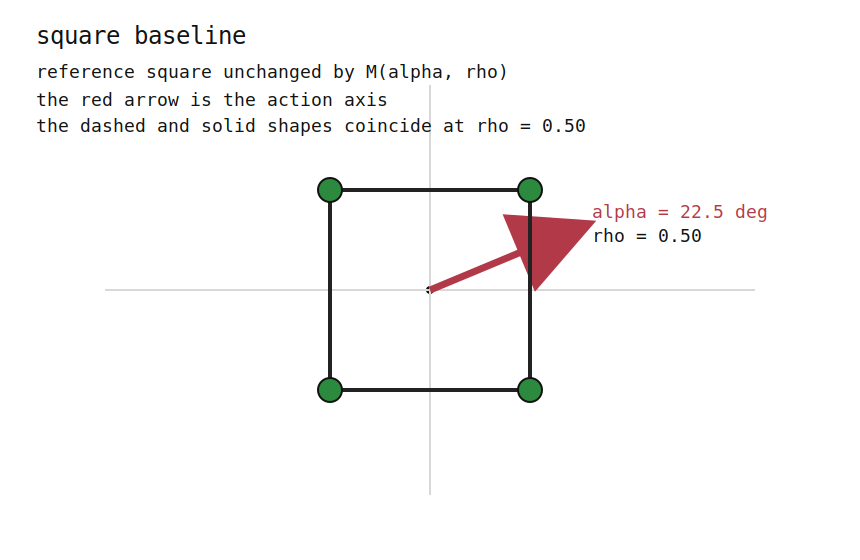
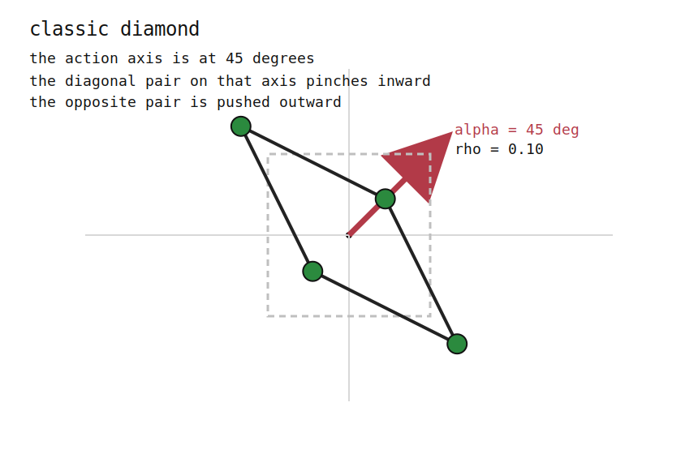
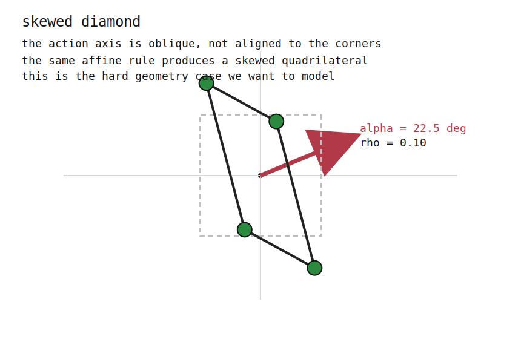
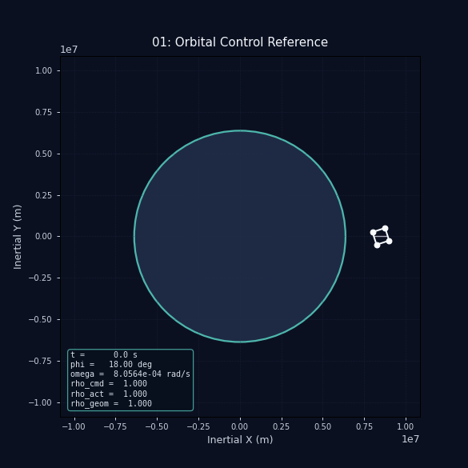
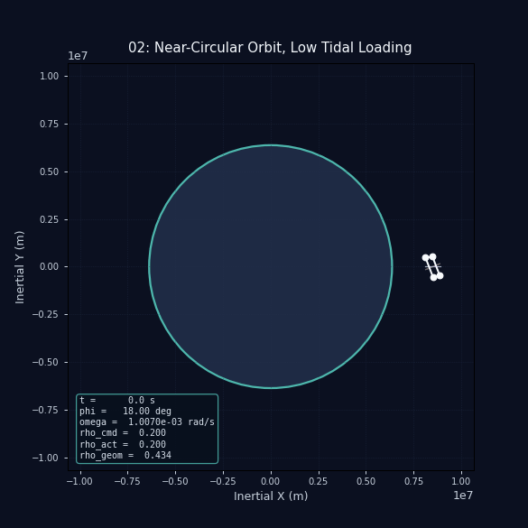
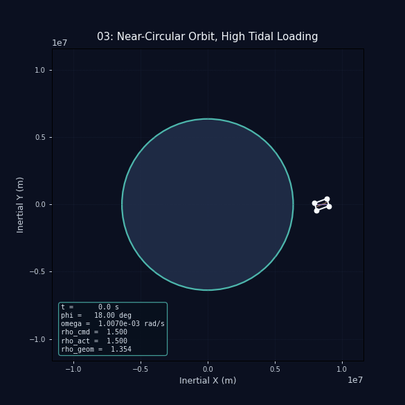

# Chapter 3: Diamond Orbital Control

Run the chapter with:

```bash
PYTHONPATH=src MPLCONFIGDIR=/tmp .env/bin/python -m diamond
```

The GIFs are written to `docs/assets/diamond_planning/`.

This chapter models a four-mass diamond in the orbital plane. The craft is not
a rigid barbell and it is not a tether-length system. The geometry is a
centrally symmetric quadrilateral whose in-plane deformation is controlled by a
single directional shape parameter `rho` and an in-plane action angle `alpha`.

The key constraint is that the total planar inertia stays fixed while the mass
distribution changes. That lets the control law alter the tidal response without
cheating by directly changing the rotational inertia.

## Model

The state used by the simulator is:

- `r_cm`, `v_cm`: center-of-mass position and velocity in the inertial frame
- `phi`: body attitude angle
- `omega`: body spin rate
- `rho_act`: filtered, realized shape command

The controller supplies:

- `alpha_cmd`: desired action-axis angle in the body frame
- `rho_cmd`: desired directional shape target

The geometry solver then maps those commands into the four body-frame corner
positions. The simulator rotates those points into the inertial frame and uses
them to compute the center-of-mass acceleration and external tidal torque.

The shape is generated from a reference square with corners
`(±1, ±1)`, scaled by a symmetric affine map:

```text
M(alpha, rho) = lambda_parallel * n n^T + lambda_perp * t t^T
```

with

```text
n = (cos alpha, sin alpha)
t = (-sin alpha, cos alpha)
lambda_parallel = sqrt(rho)
lambda_perp = sqrt(2 - rho)
```

This keeps

```text
lambda_parallel^2 + lambda_perp^2 = 2
```

so the total planar inertia stays constant by construction. In this
implementation, `rho = 1` is the undeformed square baseline, `rho < 1`
pinches the craft along the action axis, and `rho > 1` stretches it along that
axis. The limiter keeps `rho` away from the degenerate line limit.

## Geometry Snapshots

These are the same reduced geometry rules used by the simulator.

### Square Baseline

`rho = 1.0`, so the shape is the undeformed reference square.



### Classic Diamond at 45 Degrees

`alpha = 45 deg`, `rho = 0.2`. The action axis is aligned with a square
diagonal, producing the familiar diamond-like shape.



### Skewed Diamond at 22.5 Degrees

`alpha = 22.5 deg`, `rho = 0.2`. The same affine rule produces an oblique
diamond when the action axis is not aligned with a diagonal.



## Scenarios

The chapter uses a baseline orbital reference and then a small set of orbital
cases that emphasize directional tidal loading.

### 01. Orbital Control Reference



This is the simplest closed-loop orbital case. The shape is held at the
undeformed square baseline while the action axis follows the orbital frame.

### 02. Near-Circular Orbit, Low Tidal Loading



This is the low-loading reference orbit. The same geometry and controller
remain active throughout, but the target `rho` is held near the pinched end of
the allowed range.

### 03. Near-Circular Orbit, High Tidal Loading



This uses the same orbit and initial attitude as the low-loading case, but the
shape target is pushed upward. The total inertia stays fixed, so the change in
spin evolution comes from the tidal torque and mass placement, not from a
changing moment of inertia.

### 04. Orbital Pumping Up


The shape target ramps from low to high over the run. This is ordinary
time-driven orbital pumping, not the apsis-switched eccentricity control used in
the later scenarios.

### 05. Orbital Pumping Down


This is the reversed time-driven schedule on the same orbit. It is still
orbital pumping, just with the sign flipped.

### 06. Eccentricity Pumping Up


This is the apsis-switched control law. When the radius is increasing, the
controller selects one branch; when the radius is decreasing, it selects the
opposed branch. That outbound/inbound split is what makes this eccentricity
pumping rather than ordinary orbital pumping.

### 07. Eccentricity Pumping Down


This is the sign-reversed partner to the previous case. It uses the same
apsis-based switch but flips which branch is active on the two halves of the
orbit.

## Notes

- The `rho` actuator is explicitly filtered in the ODE state.
- `alpha` is not imposed as a rigid rotation; it only selects the action axis
  for the deformation.
- The renderer reuses the diagnostics helpers so the plotting code does not
  duplicate the physics.
- The chapter assets live in `docs/assets/diamond_planning/` and are generated
  from `src/diamond/main.py`.
