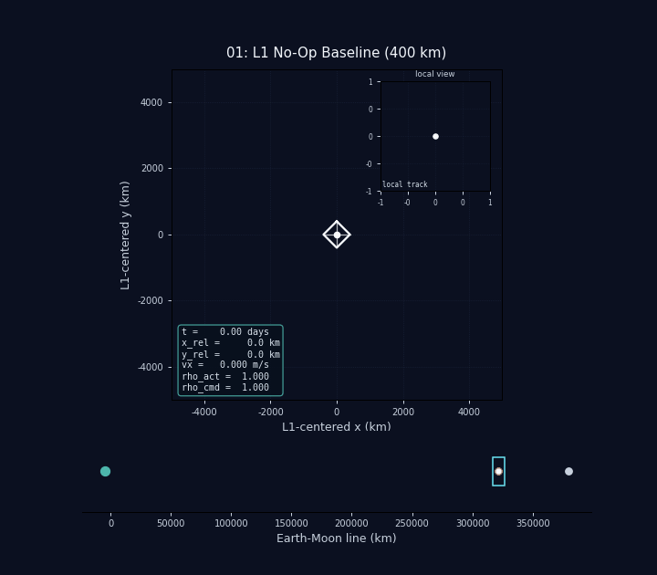
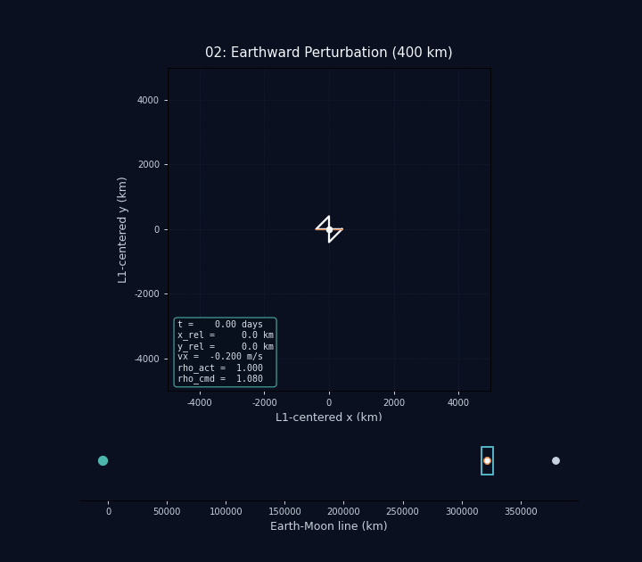
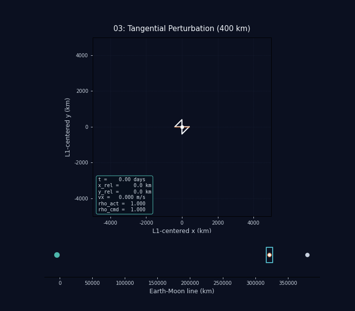
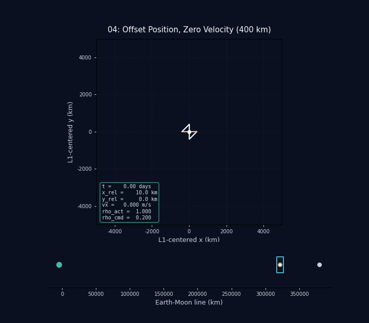

# Chapter 4: Diamond L1 Stabilizer

Run the chapter with:

```bash
PYTHONPATH=src MPLCONFIGDIR=/tmp .env/bin/python -m diamond_l1
```

The GIFs are written to `docs/assets/diamond_l1/`.

This chapter follows the variable-length barbell chapter in
[docs/variable_length_chapter.md](variable_length_chapter.md) and moves the
diamond craft into the Earth-Moon rotating frame to focus on the L1 saddle
point. The Earth and Moon are fixed in that frame, the state is kept Cartesian
internally, and the renderer shows a narrow L1-centered window with a small
Earth-Moon overview strip below it.

The published asset set uses a 400 km half-span for the diamond. That is the
chapter's fixed structure and the scale used in the rendered assets.

The control authority is modest compared with the raw L1 instability. A local
finite-difference check around the saddle point gives an unstable-axis scale of
roughly `8e-11 m/s^2` per meter of displacement, while the full 400 km diamond
shape swing changes the center-of-mass acceleration by only about
`2.6e-7 m/s^2`. That means the **full shape authority** is only comparable to a
few kilometers of L1 displacement. The much smaller `100 m` figure below is a
separate, conservative *operating* envelope used to keep the first render set
well inside the stable visual regime:

- unstable-axis position offset: about `100 m` or less
- Earthward velocity: about `6 mm/s` or less
- tangential velocity: about `1 mm/s` or less

Those limits are conservative, but they keep the chapter in the regime where
the simple proportional-plus-damping controller can visibly stabilize the
motion instead of immediately losing the craft.

To make that motion readable, the chapter uses two scales at once: the main
plot stays wide enough to keep the Earth-Moon context, while a local inset
shows the neighborhood of L1 as a dot-only track with bounds derived from the
trajectory itself. That keeps the motion readable without forcing the local
view to carry the full 400 km body scale.

The percentages below are expressed as loading on the Moonward/L1 displacement
envelope. For the velocity-only cases, the percentage is an equivalent
displacement loading computed from the controller's initial response at L1.

| Half-span | Approx. displacement envelope |
| --- | ---: |
| `400 km` | `3.2 km` |
| `1000 km` | `20 km` |
| `2000 km` | `80 km` |
| `5000 km` | `504 km` |

These are rough, order-of-magnitude figures from the current Earth-Moon model,
measured as the amount of unstable-axis displacement the full shape swing can
offset near L1.

The 100 m operating bound is intentionally smaller than that raw authority
figure. It is the range where the first visual examples stay comfortably in the
stable, legible part of the chapter.

The GIFs are intentionally truncated when the craft leaves the visible L1
window, so they end on the first off-screen frame rather than running all the
way to the full simulation horizon.

The control law is deliberately simple:

- one scalar `rho` shape command
- proportional plus damping feedback along the Earth-Moon line
- constant total moment of inertia
- no skew mode and no spin command

The active scenarios start with the diamond already set to the controller's
initial commanded shape, so the chapter shows stabilization behavior instead of
spending the first minutes just waiting for the actuator to catch up.

The point of the chapter is not perfect station keeping. It is to show how the
diamond responds near the unstable L1 axis and how the control surface can
moderate that response without turning the chapter into a full guidance system.

## Model

The state is:

- `x, y`: spacecraft center-of-mass position in the rotating Earth-Moon frame
- `vx, vy`: velocity in the rotating frame
- `rho_act`: filtered realized diamond shape

The body geometry is a four-mass diamond with one pair of masses on the
Earth-Moon line and one pair on the perpendicular axis. The scalar `rho`
continuously trades length between those two axes while keeping the planar
moment of inertia constant.

The controller watches the displacement from L1 and the velocity along the
Earth-Moon line. That is enough for the first pass:

- Earthward motion should be countered by stretching the diamond
- Moonward drift should be countered by compressing it
- the tangential case is mainly a diagnostic for side motion, not the primary
  stabilization target

## Simulation Method

The chapter keeps the integration state fully Cartesian in the rotating
Earth-Moon frame. The simulated state is:

```text
[x, y, vx, vy, rho_act]
```

with:

- `x, y`: center-of-mass position in the rotating frame
- `vx, vy`: rotating-frame velocity
- `rho_act`: the filtered shape command actually realized by the diamond

The state equation is the usual first-order position/velocity split plus the
shape actuator lag:

```text
dx/dt = vx
dy/dt = vy
d(vx)/dt = a_x(x, y, vx, vy, rho_act)
d(vy)/dt = a_y(x, y, vx, vy, rho_act)
d(rho_act)/dt = (rho_cmd - rho_act) / rho_tau
```

The acceleration term is the mean center-of-mass acceleration of the four
corner masses, including Earth gravity, Moon gravity, and the rotating-frame
centrifugal/Coriolis terms.

The damping is handled in the controller, not in the dynamics. The control law
uses:

- proportional feedback on L1 displacement along the Earth-Moon line
- derivative feedback on the Earthward/Moonward velocity

That derivative term is what gives the response its visible decay. The current
chapter uses a fairly aggressive derivative gain so the oscillation amplitude
falls instead of remaining nearly constant.

The chapter does not integrate a polar state. Everything remains Cartesian, and
the few coordinate transfers are numerical and local:

- the Earth and Moon positions are fixed once from the real Earth-Moon masses
  and orbital distance
- L1 is found once by a scalar root solve on the rotating-frame x-acceleration
- plots are translated into an `L1`-centered Cartesian view for readability
- the local inset uses the same Cartesian trajectory, only with a different
  scale

So the "polar" part is not part of the time integration. If a polar view is
needed, it is just a visualization transform applied after the Cartesian state
is already known.

## Residual Y-Axis Motion

The controller is built to stabilize the unstable `x` axis near L1, not to
eliminate every last motion component. In the published scenarios, the
Earthward and Moonward response often introduces a visible `y`-axis swing even
when the initial perturbation is purely along `x`.

That is expected with the current design:

- the shape command is one-dimensional
- the geometry keeps constant planar moment of inertia
- the model does not add an independent skew mode

So the chapter can stabilize the unstable axis while still leaving a
pendulum-like `y` response. That residual motion is stable enough to leave in
place, and it is useful because it shows the limit of the current control
surface.

In principle, a stronger controller or an additional shape degree of freedom
could reduce the `y` oscillation further. The hard part is doing that without
breaking the constant-inertia rule or introducing skewed shapes that would
change the torque picture. For the present chapter, the intent is to keep the
control law simple and let the residual `y` motion remain as a visible
secondary effect.

## Geometry

The reference diamond uses a one-parameter family:

```text
a = half_span * sqrt(rho)
b = half_span * sqrt(2 - rho)
```

with masses placed at:

```text
(+a, 0), (-a, 0), (0, +b), (0, -b)
```

This keeps the total planar inertia constant and avoids any skewed shapes.

## Scenarios

### 01. L1 No-Op Baseline



The craft starts exactly at the nominal L1 point with `x = 0 m`, `y = 0 m`,
`vx = 0 m/s`, and `vy = 0 m/s`. The control law is active but commands the
neutral shape, so this is the reference case for the chapter.

Envelope loading: `0%` of the displacement envelope.

### 02. Earthward Perturbation



The craft starts at L1 with `vx = -0.006 m/s` toward Earth and `vy = 0 m/s`.
This is the main unstable-axis test, and the chosen velocity is deliberately
kept inside the practical control envelope so the response bends back toward L1
instead of running away immediately.

Envelope loading: about `19%` of the displacement envelope, using the initial
velocity as an equivalent Earth-Moon-line demand.

### 03. Tangential Perturbation



The craft starts at L1 with `vx = 0 m/s` and `vy = 0.001 m/s` tangentially.
This is a sideways response case, not the main instability axis, but it helps
show how the local motion unfolds in the rotating frame without pushing the
craft out of the narrow L1 window.

Envelope loading: about `7%` of the displacement envelope, using the initial
velocity as an equivalent Earth-Moon-line demand.

### 04. Offset Recovery



The craft starts at `x = L1 + 500 m`, `y = 0 m`, with zero initial velocity.
This is the direct “can the controller pull back a static offset?” case.

Envelope loading: about `50%` of the displacement envelope.

### 05. Moonward Compression Stress Test


The craft starts at L1 with `vx = 0.009 m/s` moonward and the rho floor
removed. This is the velocity-driven stress case that still lets the diamond
collapse much closer to a line while keeping the motion plausibly recoverable.

Envelope loading: about `60%` of the moonward-response envelope, with the rho
floor removed so the stabilizer can compress much more aggressively.

## Notes

- The 400 km half-span is the published chapter configuration.
- The main plot is L1-centered; the lower strip shows the Earth-Moon line and
  the local window position.
- The controller is intentionally simple so the chapter can be tuned iteratively
  after the first renders.
