# Chapter 5: L1 Reachability Map

Run the chapter with:

```bash
PYTHONPATH=src MPLCONFIGDIR=/tmp .env/bin/python -m diamond_l1_reachability
```

The images are written to:

- `docs/assets/diamond_l1_reachability/reachability_global.png`
- `docs/assets/diamond_l1_reachability/reachability_l1.png`
- `docs/assets/diamond_l1_reachability/08_lunar_grazing_scan.png`
- `docs/assets/diamond_l1_reachability/09_lunar_grazing_low_speed_scan.png`
- `docs/assets/diamond_l1_reachability/10_lunar_grazing_moon_frame.png`
- `docs/assets/diamond_l1_reachability/11_lunar_grazing_102ms_scan.png`
- `docs/assets/diamond_l1_reachability/12_lunar_grazing_102ms_window_scan.png`
- `docs/assets/diamond_l1_reachability/13_lunar_grazing_102ms_window_moon_frame.png`
- `docs/assets/diamond_l1_reachability/14_lunar_grazing_120ms_window_scan.png`
- `docs/assets/diamond_l1_reachability/15_lunar_grazing_120ms_window_moon_frame.png`
- `docs/assets/diamond_l1_reachability/16_lunar_grazing_130ms_capped_scan.png`
- `docs/assets/diamond_l1_reachability/17_lunar_grazing_130ms_window_scan.png`
- `docs/assets/diamond_l1_reachability/18_lunar_grazing_130ms_window_moon_frame.png`

This chapter follows [docs/diamond_l1_chapter.md](diamond_l1_chapter.md) and
uses the same Earth-Moon model, but instead of a control law it asks a simpler
question: from the L1 point, where can a small delta-v send the craft?

The state is integrated in the Cartesian Earth-Moon rotating frame. For the
figure, that rotating frame is shifted so the Earth sits at the origin and the
Moon stays fixed on the positive x-axis. The Moon's full orbital radius is
drawn as a circular guide, and the launch point is marked at L1. Because the
equations are time reversible, the same map describes departures from L1 and
returns toward it.

The figure set shows 24 trajectories total:

- 12 launch directions, spaced every `pi/6`
- 2 launch speeds: a smaller `0.05 m/s` case and a larger `50 m/s` case

The launch directions are sampled as polar angles about L1, but the figure is
rendered as a Cartesian projection of the co-rotating Earth-Moon frame.

Each trajectory carries a dot for every day that passes. The colors cycle by
launch direction, and both launch-speed families appear on both images.

### Co-rotating Earth-Moon Frame

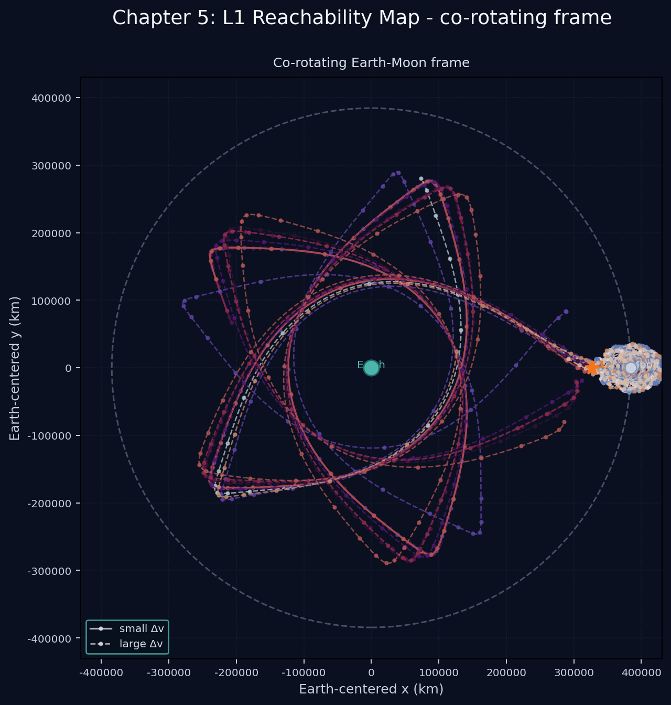

This image shows the full co-rotating Earth-Moon frame, with both the
`0.05 m/s` and `50 m/s` launch families overlaid together.

### L1 Neighborhood

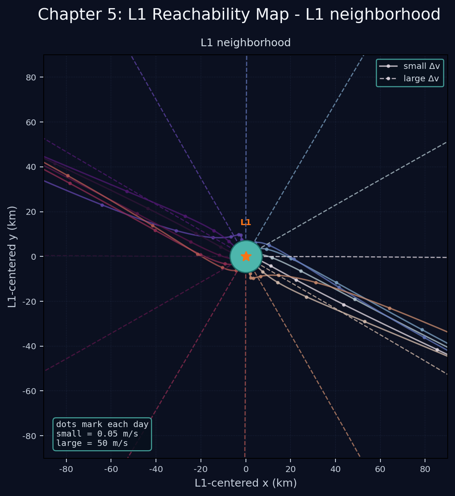

This image is the L1-centered neighborhood view, also with both launch-speed
families overlaid. The map runs for 60 days so the longer launches have room to
unfold before the picture ends.

This is deliberately a reachability map, not a station-keeping result. It is
meant to show the first-order families reachable from L1 under small delta-v,
and to make the reversible geometry visually obvious.

## Lunar Surface Grazing

The earlier `0.05 m/s` release family stays far above the lunar radius in this
model. For the mass-driver question, I step up to a `100 m/s` release. That is
still low compared with lunar orbital motion, but it is the first release speed
here that produces surface-grazing solutions.

### 08. Lunar Grazing Scan

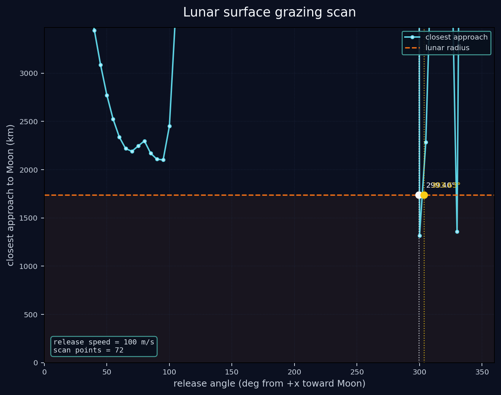

The horizontal line is the lunar radius. The key question is where the
closest-approach curve dips below that line. In this model, the primary grazing
window has two release angles:

| Release angle | Moon-surface point in moon-centered frame | Approx. lunar longitude |
| --- | --- | ---: |
| `299.40 deg` | `(-1624 km, +617 km)` | `159.2 deg` |
| `303.63 deg` | `(1737 km, -14 km)` | `-0.5 deg` |

Treating the motion as planar, those longitudes are approximate selenographic
longitudes measured from the sub-Earth meridian. The first graze lands on the
far side; the second is nearly on the Earth-facing meridian.

### 09. Low-Speed Lunar Scan

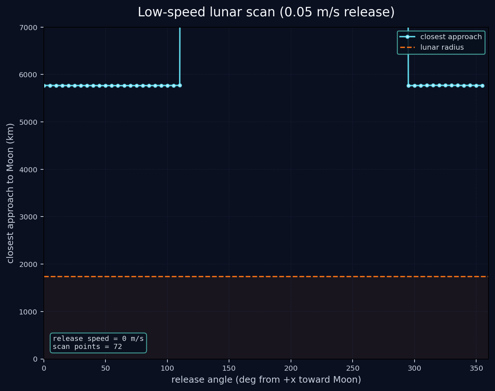

The same scan at `0.05 m/s` does not graze the Moon. The curve stays well above
the lunar radius, with the closest approach bottoming out around `5765.6 km`
at roughly `65°` release. That is still about `4028.2 km` above the surface,
so this family is useful as a contrast case but not as a surface-intersection
case.

### 10. Moon-Frame Grazing Paths

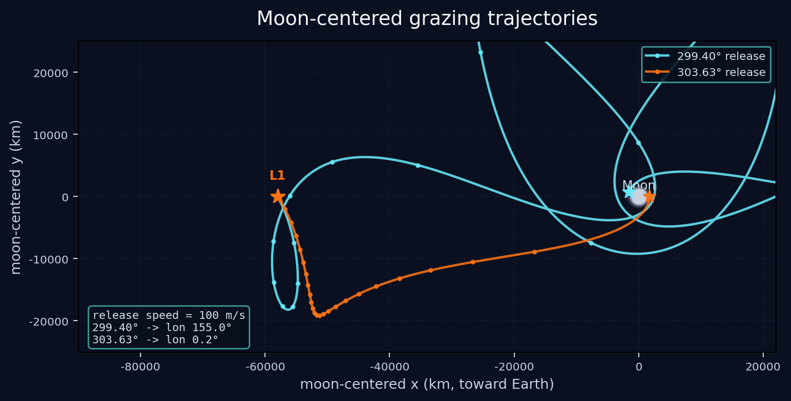

This view is centered on the Moon and shows the two grazing trajectories in the
same frame. The trajectories are truncated at their closest-approach point over
the one-orbit scan, so the plot emphasizes the approach geometry rather than
the post-perigee return.

### 11. Scan

The next step is a small speed sweep focused on the first dip of the
closest-approach curve. I am not doing any crossing search here yet; the point
is to see how the dip moves as the release speed changes.

| Release speed | First dip result | Note |
| --- | --- | --- |
| `100 m/s` | no cross | still a useful comparison case |
| `102 m/s` | closest approach about `1550 km` | this is the scan shown below |
| `120 m/s` | closest approach about `500 km` | used as the high-speed comparison point |

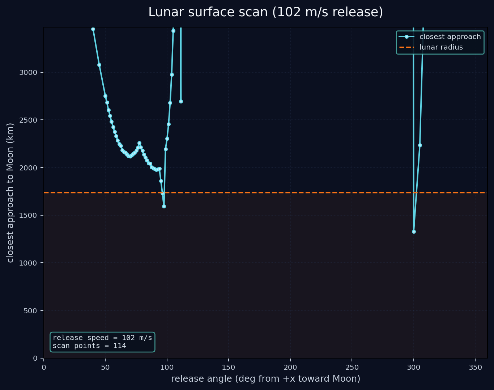

This is the same angle-versus-closest-approach scan, but at `102 m/s`. The
sample density is increased between `50°` and `120°` so the interesting dip is
easier to inspect. The table above collects the three speed cases we have
checked while looking for a crossing in the first dip.

### 12. Bounded Grazing Search

The same `102 m/s` release is now searched only between `70°` and `100°` to
find exact surface intersections in the first dip. This bounded search still
uses the same root-finding method as the earlier grazing section, but it does
not look outside the requested window.

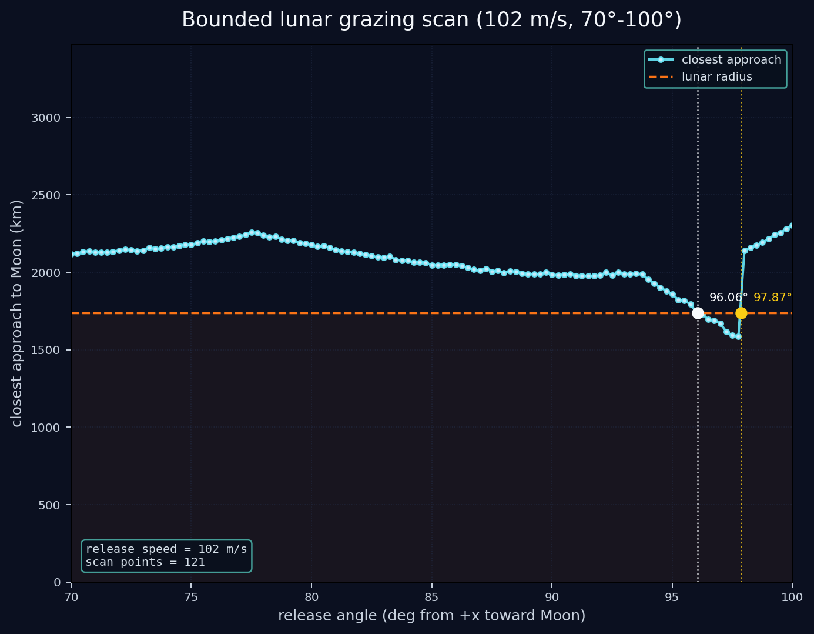

Within that window, the scan brackets two surface contacts:

| Release angle | Moon-centered surface point | Approx. lunar longitude |
| --- | --- | ---: |
| `96.06 deg` | `(1548 km, 788 km)` | `27.0 deg` |
| `97.87 deg` | `(1667 km, -489 km)` | `-16.4 deg` |

The first solution lands on the near-side eastern limb. The second solution
lands near the end of the one-orbit window and still corresponds to a surface
contact in the bounded search.

Treating the motion as planar, those longitudes are approximate selenographic
longitudes measured from the sub-Earth meridian.

### 13. Moon-Frame Bounded Trajectories

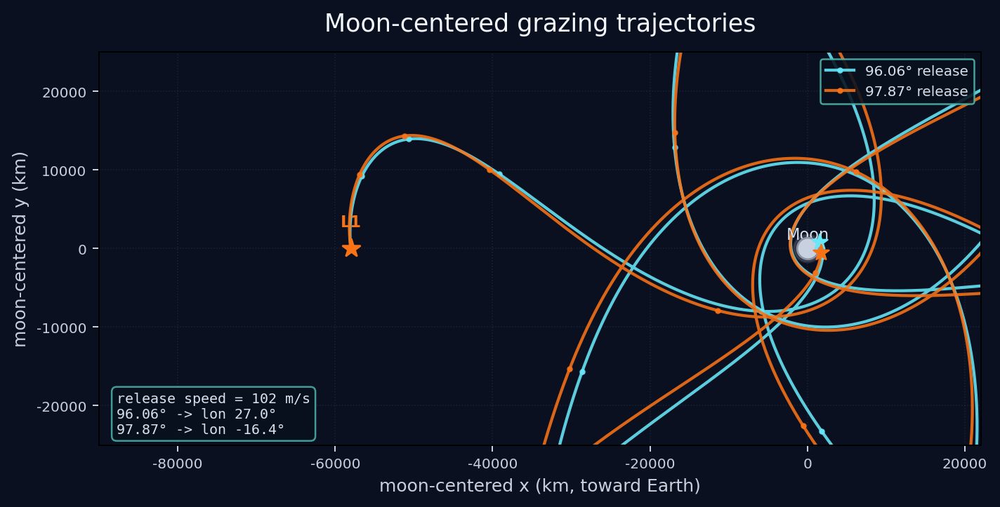

This moon-centered plot shows only the two bounded-search trajectories. It is
the same trajectory plot method as before, just restricted to the
`70°`-to-`100°` grazing window.

These are complex approaches, not the simple approach.

### 14. Bounded 120 m/s Grazing Search

The next pass returns to `120 m/s` and repeats the same bounded search method,
but now only over `50°` to `100°`. In this window the search finds a single
surface contact.

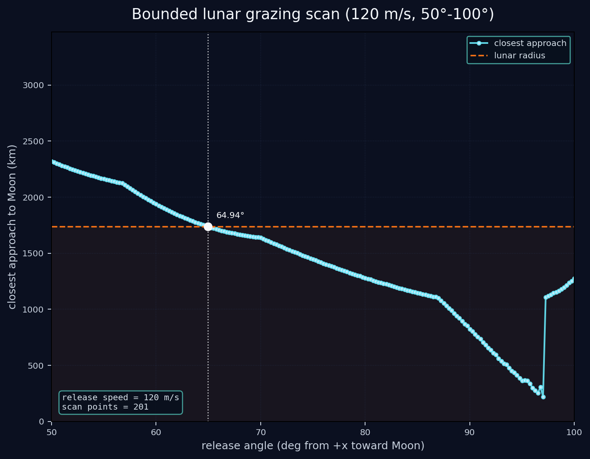

| Release angle | Moon-centered surface point | Approx. lunar longitude |
| --- | --- | ---: |
| `64.94 deg` | `(-1454 km, +951 km)` | `146.8 deg` |

This point lands on the far-side approach branch in the moon-centered frame.
Treating the motion as planar, the longitude is approximate and measured from
the sub-Earth meridian.

### 15. Moon-Frame 120 m/s Trajectory

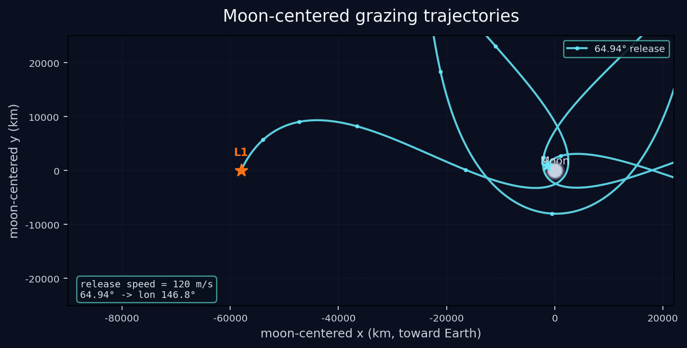

This moon-centered plot shows the single bounded-search trajectory at
`120 m/s`. It is the same trajectory plot method as before, now applied to the
`50°`-to-`100°` window.

### 16. Capped 130 m/s Scan

The next exploratory pass increases the release speed to `130 m/s` and caps the
integration at `8.4 days`. This is only the first graph again: angle versus
closest approach. I am not looking for crossings yet.

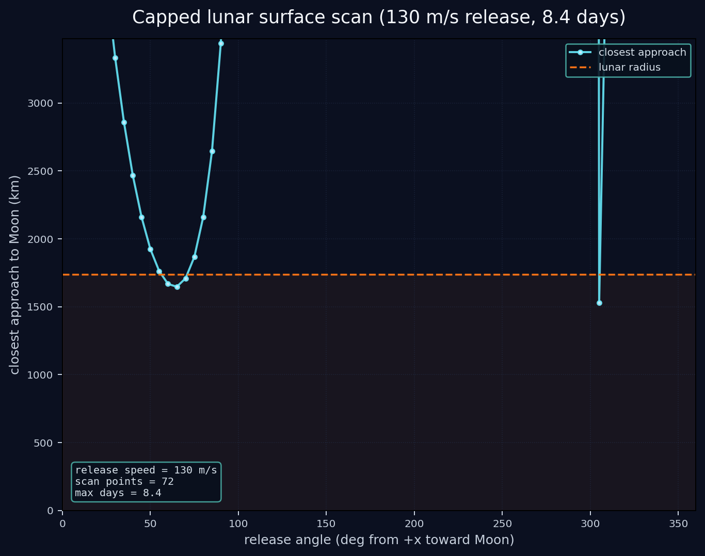

The capped scan bottoms out at roughly `1528 km` closest approach near `305°`
release. The hard stop is intentional, so the scan only shows the first part of
the approach geometry.

### 17. Bounded 130 m/s Grazing Search

The next step keeps `130 m/s`, keeps the `8.4 day` cap, and now looks only
between `50°` and `100°`. This does produce a pair of exact surface contacts.

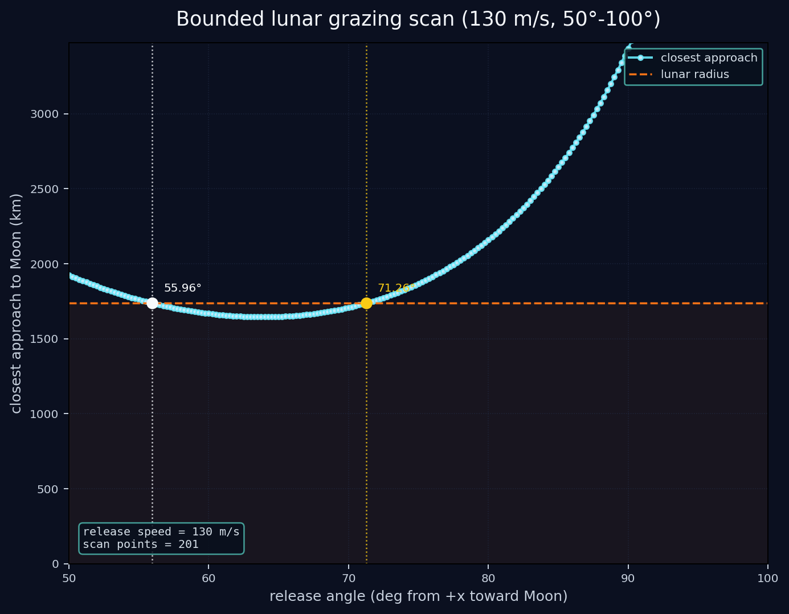

| Release angle | Transit time | Moon-centered surface point | Approx. lunar longitude |
| --- | ---: | --- | ---: |
| `55.96 deg` | `2.666 days` | `(1443 km, -968 km)` | `-33.9 deg` |
| `71.26 deg` | `3.013 days` | `(1348 km, -1096 km)` | `-39.1 deg` |

These are complex approaches, not the simple approach. Treating the motion as
planar, the longitudes are approximate and measured from the sub-Earth
meridian.

### 18. Moon-Frame 130 m/s Trajectory

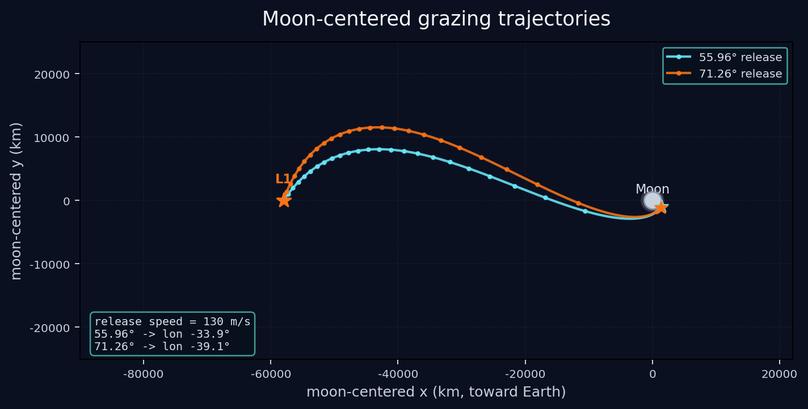

This moon-centered plot shows the two bounded-search trajectories at
`130 m/s`, using the same `8.4 day` cap and the same `50°`-to-`100°` window.
