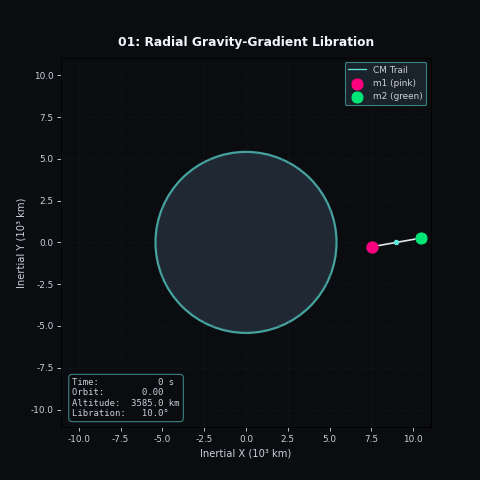
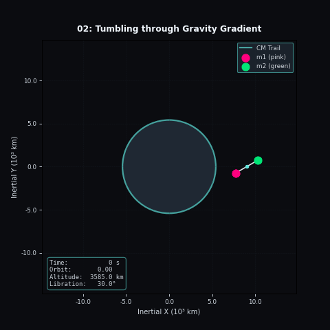
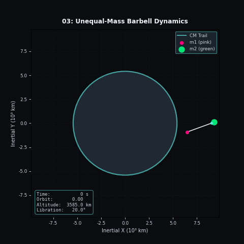
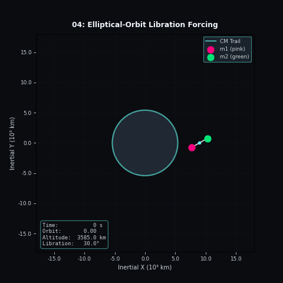
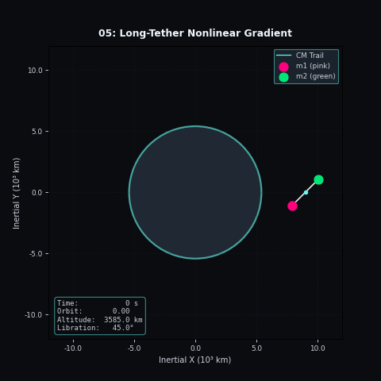
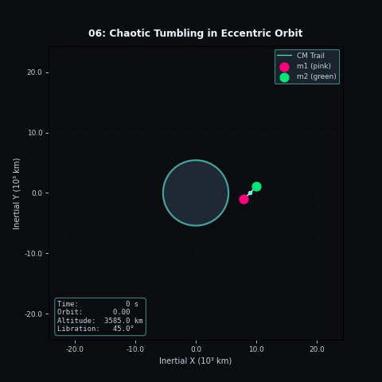
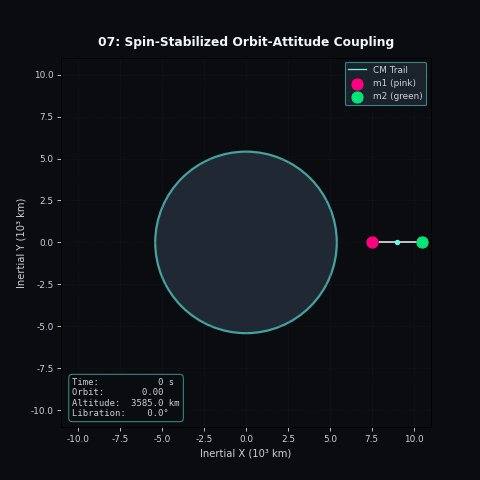

# Chapter 1: Rigid Barbell

Run the chapter with:

```bash
python main.py
```

The GIFs are written to `docs/assets/rigid_barbell/`.

## 01. Radial Gravity-Gradient Libration



The barbell starts slightly off the local radial line and gravity-gradient torque
pulls it back toward alignment. The resulting motion is a gentle libration about
the equilibrium axis.

## 02. Tumbling through the Gravity Gradient



The initial spin is high enough that the barbell does not remain trapped in the
restoring potential. It keeps rotating through the torque field, and the angular
speed varies as the gravity gradient alternately helps and resists the motion.

## 03. Unequal-Mass Barbell Dynamics



The center of mass sits closer to the heavier endpoint, so the lighter side sweeps
through a larger arc. The asymmetry is geometric rather than numerical noise.

## 04. Elliptical-Orbit Forcing



On an eccentric orbit, the gravity-gradient torque changes with orbital radius.
The barbell experiences stronger restoring action near perigee and weaker action
near apogee.

## 05. Long-Tether Nonlinear Gradient Effects



With a very long tether, the endpoint forces are no longer well approximated by a
linearized gradient. The center-of-mass path and endpoint traces begin to show the
nonlinear structure of the field.

## 06. Chaotic Tumbling in Eccentric Orbits



The combined orbital and attitude frequencies create sensitivity to initial
condition. Small changes in phase can move the barbell between temporary captures
and more irregular tumbling.

## 07. Spin-Stabilized Orbit-Attitude Coupling



The barbell spins quickly enough that the attitude is fairly stiff, but the fast
rotation still feeds back into the center-of-mass motion as a small radial wobble.

## 08. Spin-Stabilized Elliptical Orbit


Fast spin in an eccentric orbit suppresses large attitude swings while the varying
gravity gradient modulates the motion over the orbit.
