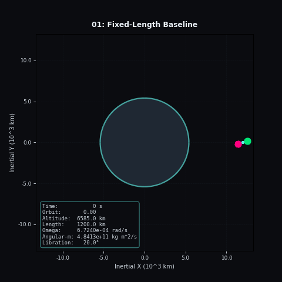
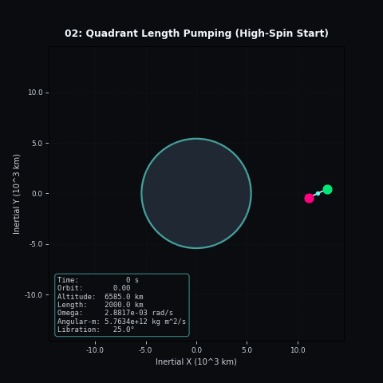
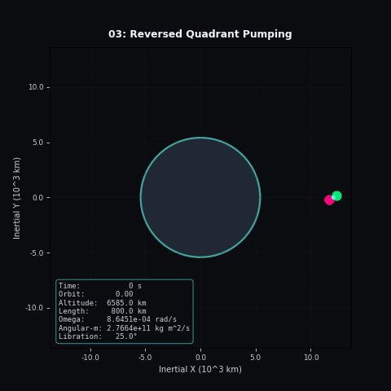

# Chapter 2: Variable Length Tether

Run the chapter with:

```bash
MPLCONFIGDIR=/tmp .env/bin/python -m tether_length_control
```

The GIFs are written to `docs/assets/tether_length_control/`.

## 01. Fixed-Length Baseline



This is the control case. The tether length is constant, so the motion shows the
baseline coupled orbit-and-spin dynamics without any active length pumping.

## 02. Quadrant Length Pumping



The length law alternates extension and retraction across the attitude quadrants.
With the high-spin start, the spin-down direction is visible and the orbit responds
in a cleaner directional pattern.

## 03. Reversed Quadrant Pumping



This is the sign-flipped partner to the previous case. It keeps the same geometry
but reverses the schedule, which makes the classic directionality contrast obvious.

## 04. Perigee/Apogee Pumping


The tether changes length at the apses rather than during approach. Over multiple
orbits, the effect accumulates slowly and the orbit begins to drift in the expected
direction.

## 05. Reversed Perigee/Apogee Pumping


This is the reversed apsis schedule with a faster initial spin. The stronger spin
helps suppress the one-off chaotic sensitivity that showed up in the earlier
version of the case.
